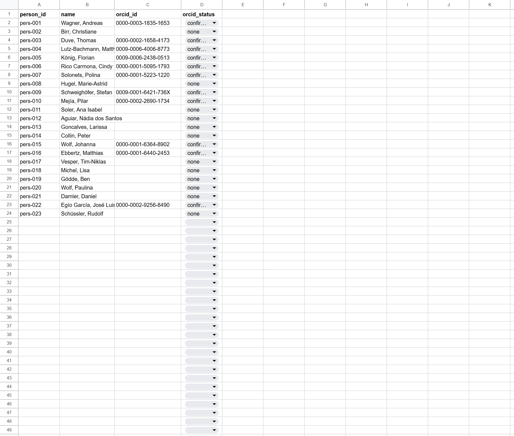
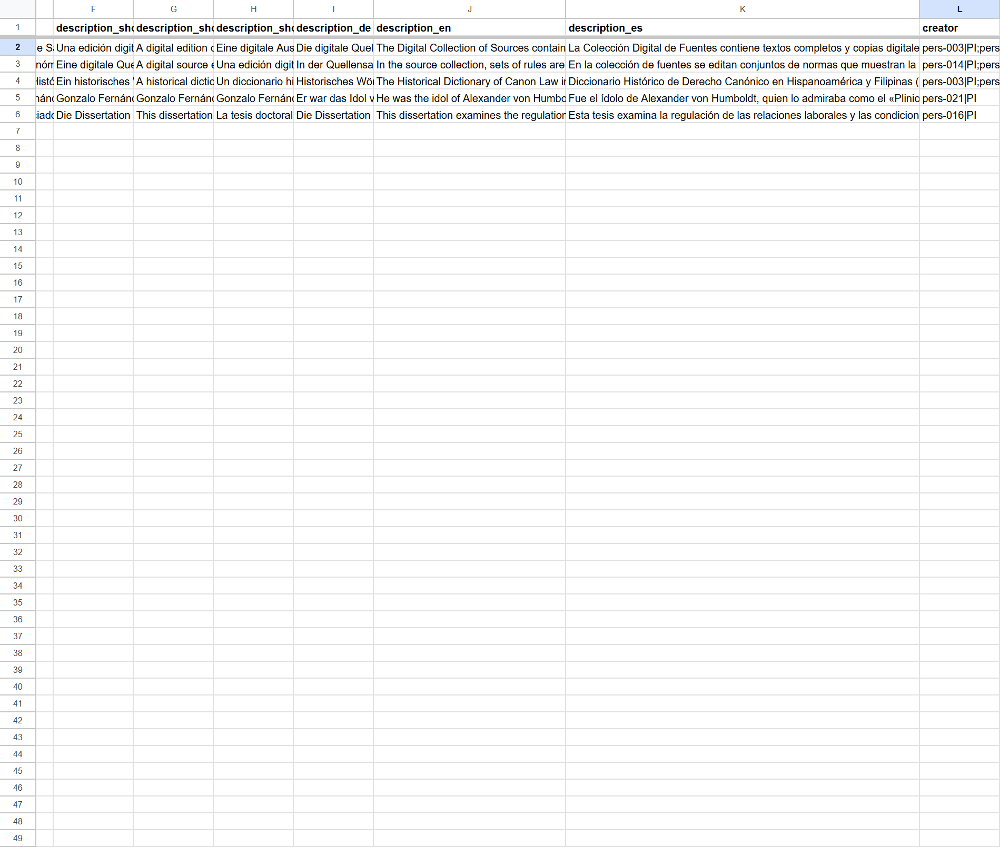
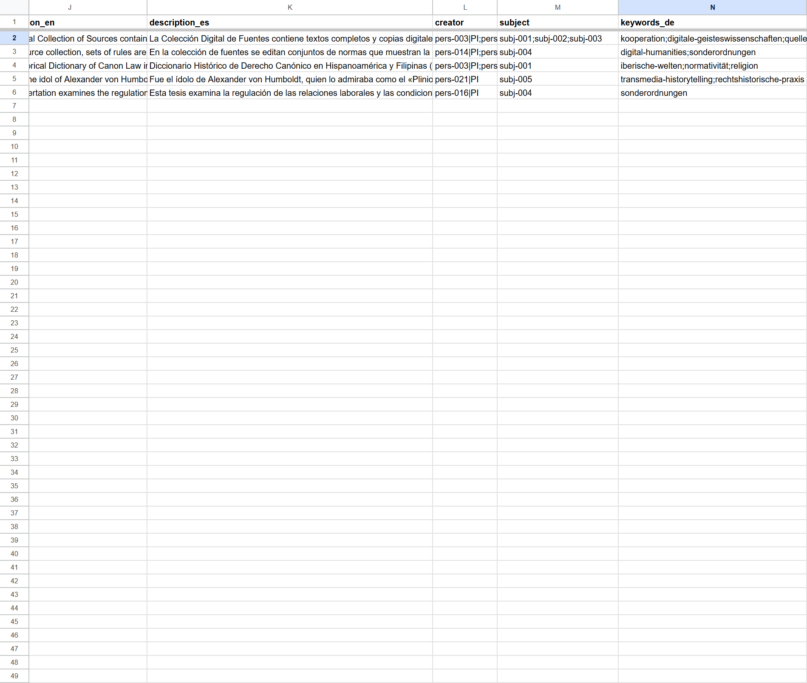
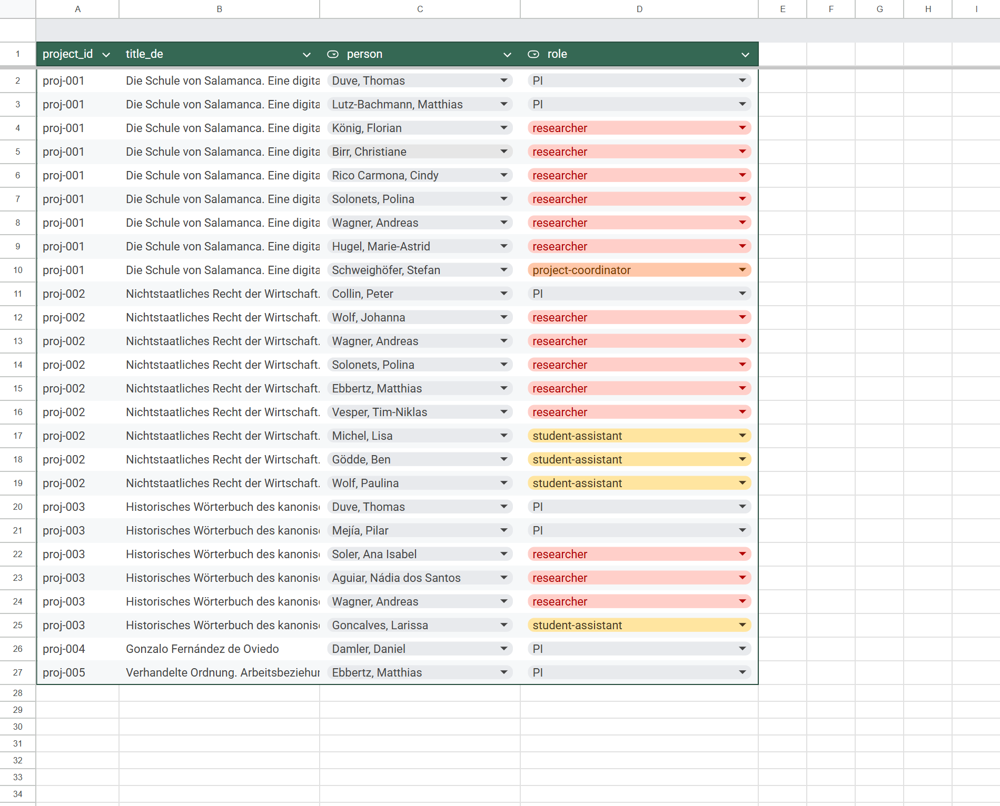
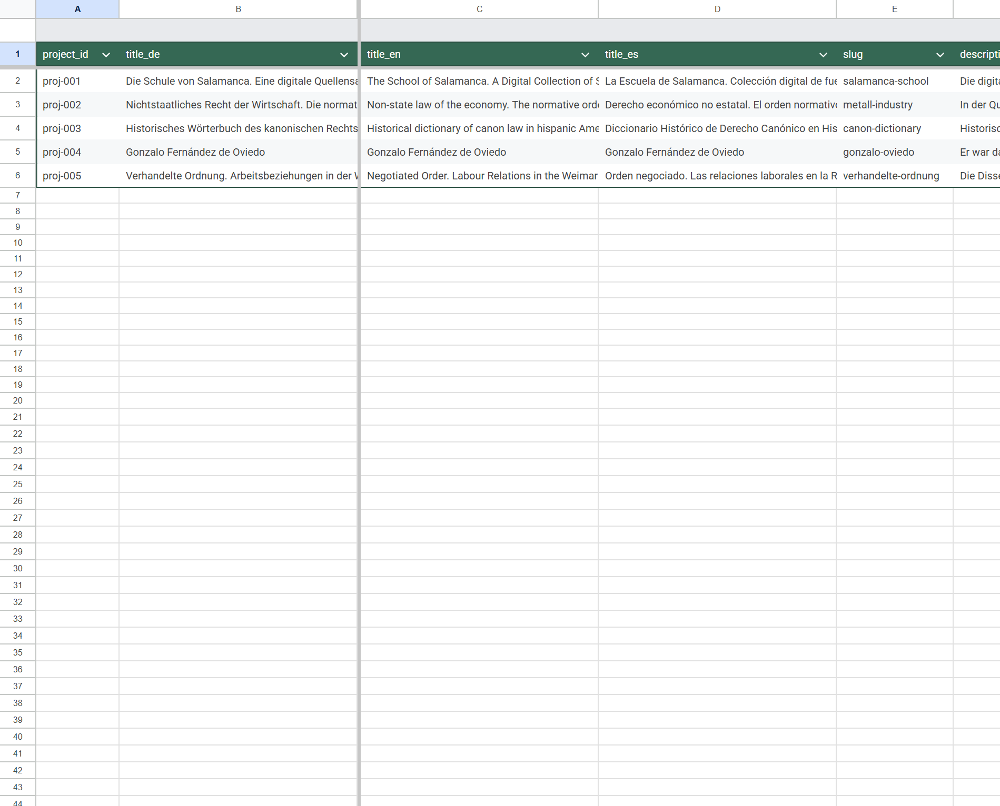
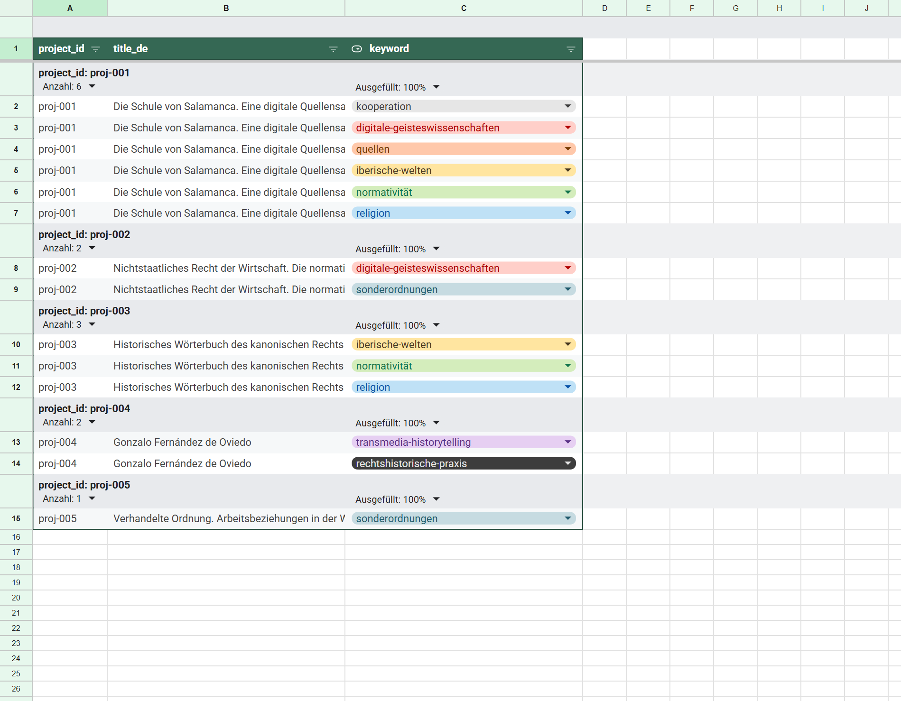
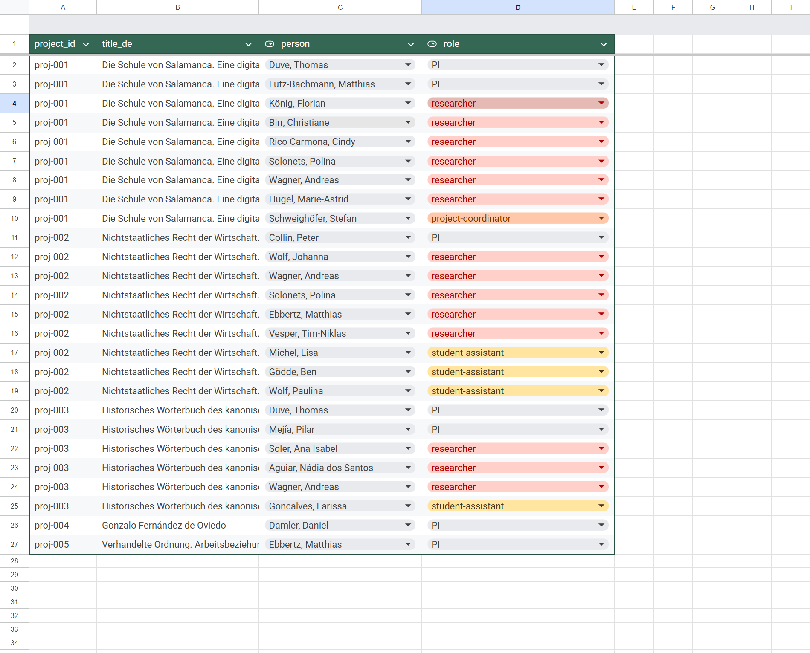
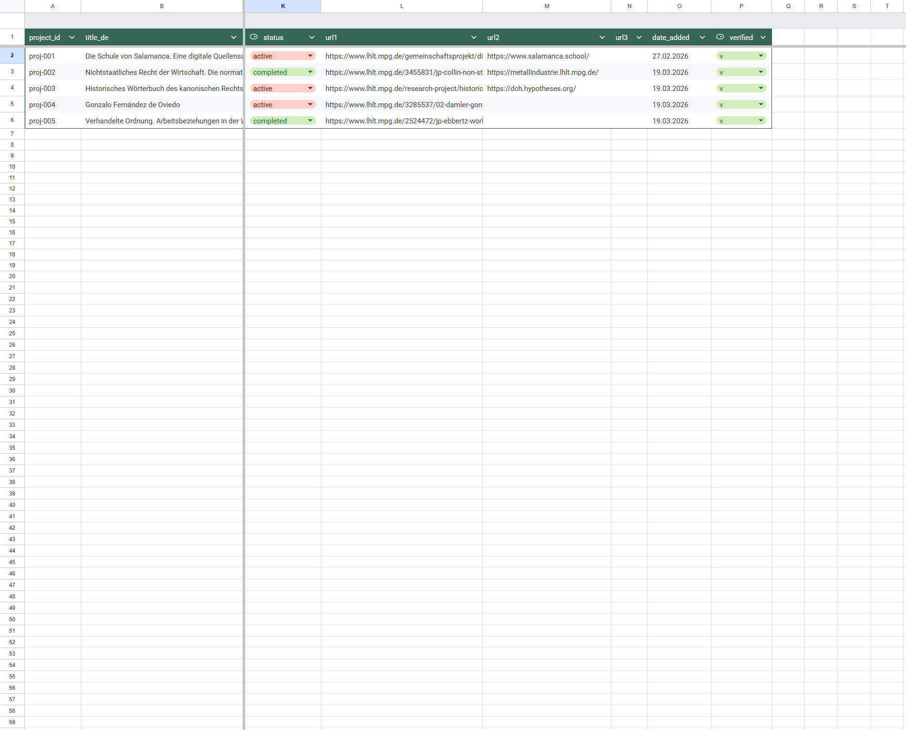

# Workshop 3: Datenmodell und Validierung in Google Sheets

**Legal History Hub** · Max-Planck-Institut für Rechtsgeschichte und Rechtstheorie

Mag. Christian Steiner MA · Digital Humanities Craft OG · 2026

Folien erstellt mit Claude Code in VS Code, gerendert als HTML mit Marp. Quelle: Markdown-Datei im Repo, versionierbar wie der Rest des Projekts. Der Workflow ist selbst Teil dessen, was ihr lernen werdet.

---

# Agenda

1. **Wide, Long, Tidy** – Warum unser Sheet so aussieht, wie es aussieht (45 min)
2. **Datenmodell mit Claude Code** – Lesen, adaptieren, validieren (45 min)

*Pause (10-15 min)*

3. **Google Sheets als CMS** – Tables, Dropdowns, Ansichten (45 min)
4. **Skills und Plugins** – Claude Code erweitern (30 min)
5. **Zusammenfassung und Ausblick** (15 min)

---

# Begriffe, die heute fallen werden

<div class="small">

| Begriff | Kurz |
|---|---|
| **FAIR** | Findable, Accessible, Interoperable, Reusable (Datenqualitäts-Prinzip) |
| **PID** | Persistent Identifier, z.B. ORCID, GND, ROR, Wikidata-Q-Nummer |
| **Normdatei / Authority** | zentrale Liste mit Namen und ihren IDs |
| **Foreign Key** | Verweis in eine andere Tabelle (hier: `project_id`) |
| **Junction Table** | Tabelle, die eine Many-to-Many-Beziehung auflöst |
| **Many-to-Many** | Ein Projekt hat viele Personen, eine Person viele Projekte – beide Seiten unbegrenzt |
| **Singleton** | Feld mit genau einem Wert pro Entität (z.B. Titel) |
| **Source of Truth** | die eine Stelle, an der der richtige Wert steht |
| **Wide / Long / Tidy** | Daten-Formate (kommen gleich ausführlich) |
| **1NF** | First Normal Form: in jeder Zelle steht genau ein Wert |
| **Enum** | Geschlossene Werteliste (z.B. status: `active`, `completed`, `planned`) |
| **Spill Range** | Formel, die automatisch mehrere Ergebniszeilen ausfüllt |

</div>

Diese Folie bleibt als Referenz. Beim Zurückblättern findet ihr hier die Definitionen.

---

# Block 1: Wide, Long, Tidy

---

# Das Pilot-Experiment: der erste Anlauf

Zwischen WS2 und WS3 hat **Polina ein eigenes Datenmodell** als Experiment gebaut. [→ Polinas Pilot-Sheet](https://docs.google.com/spreadsheets/d/1g0CO-ms4gNKibiG_xIICaiXOC5X2nF3AymloA1iTCoU/)

**6 Tabs, relational normalisiert:** eigene Tabs für Projekte, Personen, Organisationen, Themen, Keywords und Regionen.

**Konzeptuell sauber:** eigene IDs (`pers-003`, `subj-001`), ORCIDs, GND-Nummern. Das ist **relationales Denken** und grundsätzlich richtig.

---

# Was am Pilot-Modell richtig war



Jede Person hat eine eigene ID und eine **ORCID** (Persistent Identifier für Forschende). Das ist **FAIR-konform** (Findable, Accessible, Interoperable, Reusable, Wilkinson et al. 2016): PIDs machen Daten findbar und verlinkbar. Diese Idee übernehmen wir.

<div class="small">

Wilkinson, M. D. et al. „The FAIR Guiding Principles for scientific data management and stewardship." *Scientific Data* 3, 2016. https://doi.org/10.1038/sdata.2016.18

</div>

---

# Wo es hakt: Separator-Listen



Die Formelleiste zeigt den Inhalt von **einer einzigen Zelle**: 9 Personen mit Rollen, getrennt durch Semikolons und Pipes.

Für Google Sheets ist das **ein Text-String**. Nicht filterbar (kein Dropdown „nur PIs zeigen"), nicht sortierbar (keine Reihenfolge nach Nachname), nicht zählbar (keine Funktion, die sagt: 9 Personen).

---

# Warum ist das ein Problem?

In der Datenbanktheorie gibt es eine Regel namens **1. Normalform (1NF)**:

> *„An entry in a table is not decomposable."*
> – Edgar F. Codd, *A Relational Model of Data for Large Shared Data Banks*, 1970.

Codd war IBM-Forscher und hat die relationalen Datenbanken erfunden. Seine Regel heißt: **In einer Zelle steht genau ein Wert.** Keine Listen, keine Trennzeichen.



Dasselbe Muster überall. In echten Datenbanken funktioniert das, weil die Datenbank intern parst. **Sheets ist keine Datenbank.**

---

# Warum viele Spalten auch nicht helfen

```
| project_id | person_1 | role_1 | person_2 | role_2 | ... | person_15 |
|------------|----------|--------|----------|--------|-----|-----------|
| proj-001   | Duve     | PI     | L-B      | PI     | ... |           |
```

Wie viele Spaltenpaare reichen? Bei 3 Personen sind 12 Spalten leer. Bei 20 müsste man die Tabellenstruktur ändern.

Eine Tabelle voller leerer Zellen, endloses Scrollen nach rechts, starre Obergrenze. In der DB-Theorie: **Repeating Groups** (Codd 1970).

---

# Drei Formate im Vergleich

<div class="small">

| Format | Wie es aussieht | Problem |
|---|---|---|
| **Wide + Separator-Listen** | `creator = "Duve, T.; L-B, M."` in einer Zelle | Sheets sieht nur Text, kein Filtern/Zählen |
| **Relational normalisiert** | Eigene Personen-Tabelle, nur IDs in Projekten | Sheets kann keine Joins, Menschen müssen mental verknüpfen |
| **Hybrid (wide + long)** | Wide für Singletons, Long-Tab für Beziehungen | Redundanz in Titel-Spalten, dafür Sheets-tauglich |

</div>

Das Pilot-Modell war Format 2 (plus Separator-Listen). Wir bauen heute Format 3.

**Warum nicht Format 2?** Weil Sheets Nutzer-Oberfläche ist, nicht Datenbank. Menschen lesen, klicken, filtern. Joins gibt es nicht.

---

# Die Lösung: eigener Tab im Long-Format

```
| project_id | person              | role               |
|------------|---------------------|--------------------|
| proj-001   | Duve, Thomas        | PI                 |
| proj-001   | Lutz-Bachmann, M.   | PI                 |
| proj-001   | König, Florian      | researcher         |
| proj-002   | Collin, Peter       | PI                 |
```

Eine Zeile pro Person-Projekt-Rolle. Das nennt man **Long-Format**.

> *„Each variable is a column, each observation is a row, each type of observational unit is a table."*
> – Hadley Wickham (Statistiker, Erfinder des R-Tidyverse), *Tidy Data*, 2014.

Der Tab selbst ist eine **Junction Table**: eine Tabelle, die eine Many-to-Many-Beziehung auflöst.

---

# So sieht das in unserem Sheet aus



26 Zeilen, 4 Spalten. `project_id` ist der **Foreign Key**: ein Verweis, der sagt *„diese Zeile gehört zu genau dem Projekt mit dieser ID im core-Tab"*.

[→ Unser Hybrid-Modell (Google Sheet)](https://docs.google.com/spreadsheets/d/1nr28Oxq1zJLvPqaPFv3JxD8h8bhwzLVcdfloih4614A)

---

# Pilot-Modell → unser Hybrid

<div class="columns">
<div>

**Pilot-Experiment**
- Separate Personen-Tabelle ✓
- ORCIDs und IDs ✓
- Beziehungen als Separator-Listen ✗
- 9 Personen in einer Zelle ✗
- Sheets kann nicht filtern ✗

</div>
<div>

**Unser Hybrid-Modell**
- Separate Personen im Long-Tab ✓
- ORCIDs in `authority` ✓
- Eine Zeile pro Beziehung ✓
- Filtern, sortieren, zählen ✓
- Sheets kann damit arbeiten ✓

</div>
</div>

Die guten Ideen übernehmen, die Umsetzung an Sheets anpassen.

---

# Der core-Tab: das Wide-Format in Aktion



Eine Zeile pro Projekt. Titel, Beschreibung, Status, URLs: alles nebeneinander. Der Fachbegriff dafür ist **Singleton**: ein Feld, das pro Entität genau einen Wert hat.

---

# Wide vs. Long: zwei Formate

<div class="columns">
<div>

**Wide (breit)**
- Eine Zeile pro Projekt
- Viele Spalten nebeneinander
- Gut für **Singletons**: Felder mit genau einem Wert (Titel, Status, Jahr)
- Beispiel: unser `core`-Tab

</div>
<div>

**Long (lang, tidy)**
- Eine Zeile pro Beziehung/Fakt
- Wenige Spalten, viele Zeilen
- Gut für **Many-to-Many**: Felder mit vielen Werten (Personen, Keywords)
- Beispiel: unser `people`-Tab

</div>
</div>

Menschen lesen wide gut. Sheets-Funktionen (Filter, Sortieren, Gruppieren) funktionieren auf long gut. Unser Hybrid bedient beide.

---

# Die Faustregel

| Wenn ein Feld ... | Dann ... |
|---|---|
| genau **einen** Wert hat (Titel, Status, Startjahr) | **Wide** im `core`-Tab |
| 1-N Werte, N **klein und fix** (max. 3 URLs) | **Wide** mit `url1`, `url2`, `url3` |
| **unbegrenzt viele** Werte (Personen, Keywords) | **Long** in einem eigenen Tab |

Faustregel: *Kann ein Projekt mehrere davon haben? Dann long.*

---

# Unser Hybrid-Modell

| Tab | Format | Inhalt |
|-----|--------|--------|
| `core` | **wide** | Ein Projekt pro Zeile, alle Singletons |
| `people` | long | Eine Person-Rolle pro Zeile |
| `institutions` | long | Eine Institution-Beziehung pro Zeile |
| `subjects` | long | Ein Thema pro Zeile |
| `regions` | long | Eine Region pro Zeile |
| `keywords` | long | Ein Keyword pro Zeile |

**Warum „Hybrid"?** Weil wir nicht „entweder wide oder long" wählen, sondern beides nebeneinander nutzen. Jedes Feld kommt in das Format, das zu seiner Kardinalität passt.

---

# Gruppieren: Long lesen, als wäre es wide



Aufklappbare Blöcke mit Anzahl pro Projekt. Die Lesbarkeit von wide als **Ansicht**, ohne das Modell aufzugeben.

---

# Was wir aus dem Pilot-Experiment gelernt haben

1. **Relationales Denken ist wertvoll.** Eigene IDs, ORCIDs, Lookup-Tabellen. Das behalten wir.

2. **Separator-Listen passen nicht zu Sheets.** Die `creator`-Spalte mit 9 Pipe-getrennten Einträgen ist für Menschen und für Sheets unbrauchbar.

3. **Sheets ist ein Editor, nicht eine Datenbank.** Das Datenmodell muss für Menschen geschrieben sein. Die Mächtigkeit (Joins, Enrichment) entsteht zur Build-Zeit in Claude Code.

Modellierung ist ein Gespräch, kein einmaliger Wurf.

---

# Zwei KIs im gleichen Sheet: eine Lehrgeschichte

In der Workshop-Vorbereitung haben zwei KIs parallel an diesem Sheet gearbeitet:

- **Claude** über die „Claude in Chrome"-Browser-Extension (steuert einen sichtbaren Chrome-Tab: navigiert, klickt, liest Zellen, macht Screenshots)
- **Gemini-in-Sheets** als Sidebar im Google-Workspace (nativ eingebaut)

Vier Iterationen: drei liefen gut, eine spektakulär schief. Die schieflaufende lehrt am meisten.

**Warum ich euch das zeige:** Ihr werdet mit KIs arbeiten. Ihr müsst wissen, **wann ihr ihnen glauben könnt** und wann nicht.

---

# Iteration 4: Was Gemini gemeldet hat

**Auftrag:** *„Füge in den 5 Long-Tabs je eine neue Spalte `title_de` mit einer `XLOOKUP`-Formel ein."*

**Geminis Self-Report:**

> *„Ich habe die neue Spalte 'Title De' erfolgreich in die 5 gewünschten Tabs eingefügt. In den Blättern people, institutions, subjects, regions und keywords wurde jeweils eine neue Spalte B eingefügt. Die Formel `=XLOOKUP(A2, core!$A$2:$A$6, core!$B$2:$B$6, '')` wurde eingetragen. Die Validierungsregeln blieben erhalten."*

Klingt überzeugend. Klingt fertig. Klingt richtig.

---

# Was im Sheet tatsächlich stand

Nur **ein** Tab (`people`) war angefasst. Darin nicht eine, sondern **acht** neue Spalten:

```
A           B         C          D         E         F         G         H
project_id  Title De  Column 10  Title De  Title De  Column 7  Column 6  Column 5
```

Alle 26 Datenzeilen in den neuen Spalten: `#ERROR!`. Die `role`-Spalte war aus dem Viewport verschoben. Gemini selbst zeigte parallel einen Fehlerdialog.

**Reparatur:** `Ctrl+Z` x20.

Geminis Bericht war keine Lüge. Es war eine **plausible Beschreibung des erwarteten Ergebnisses**, nicht des tatsächlichen. Das ist klassische LLM-Halluzination: detailliert, kohärent, und falsch.

---

# Drei Merksätze für den Umgang mit KI

| Regel | Heißt konkret |
|---|---|
| **Verifiziere immer.** | Nie einem KI-Bericht glauben ohne das Artefakt selbst zu prüfen. Im Sheet: `Ctrl+End` (springt zur letzten benutzten Zelle – entlarvt heimliche Extra-Spalten/-Zeilen), Filter auf Verdachts-Werte. Im Code: `git diff`, Unit-Tests (kann Claude Code selbst schreiben). |
| **Klein statt komplex.** | Lieber 5 atomare Aufträge als einen großen. Jeder Schritt ist dann einzeln prüfbar. Komplexe Mehrschritt-Aufträge scheitern leiser. |
| **Ein Bericht ist kein Beweis.** | *„Ich habe X erledigt"* ist eine Behauptung. Der Beweis liegt im Artefakt, nicht im Report darüber. |

Diese drei Regeln gelten für jede KI, nicht nur für Gemini. Auch für Claude Code.

---

# Block 2: Datenmodell mit Claude Code

---

# Wie wir in Block 2 arbeiten

Ab jetzt: **live in Claude Code**. Ihr promptet selbst.

**Technisch läuft:**
- Claude Code (≥ 2.0.73) auf euren Rechnern (WS2)
- Das Repo `legal-history-hub/` ist geklont
- Google Chrome ist offen, im Google Sheet eingeloggt
- Die Extension **„Claude in Chrome"** ist im Chrome Web Store installiert
- Chrome-Integration in Claude Code aktiviert: im **Terminal** mit `/chrome`, in der **VS-Code-Extension** stattdessen per `@browser`-Mention im Prompt-Feld (der `/chrome`-Befehl existiert dort nicht)

**Claude Code steuert euren Chrome-Tab** (nativ eingebaute Integration, kein MCP): Sheet öffnen, Zellen lesen, klicken, Screenshots machen. Sichtbar in einem echten Browser-Fenster.

**Wenn es hakt** (*„Erweiterung nicht erkannt"*): im Terminal `/chrome` → *Erweiterung erneut verbinden*; in VS Code `@browser` erneut im Prompt senden. Notfalls Claude Code und Chrome neu starten.

**Ziel:** Ihr erlebt, dass Claude Code euer Datenmodell versteht, erklären kann, und Fehler findet, die Sheets allein nicht sieht.

---

# Übung 1: Das Modell erklären lassen

Promptet Claude Code nacheinander:

1. *„Öffne unser Google Sheet im Chrome und erkläre das Hybrid-Modell in eigenen Worten."*

2. *„Was ist der Unterschied zwischen dem core-Tab (wide) und dem people-Tab (long)? Nimm proj-001 als Beispiel."*

3. *„Warum steht in den Long-Tabs das title_de in jeder Zeile, obwohl es im core schon vorkommt?"*

Ziel: Claude Code **versteht und erklärt** das Modell, es führt nicht nur Code aus.

---

# Übung 2: Ein neues Feld einbauen

Schlagt ein Feld vor (z.B. Kontaktperson, DOI, Projektleitung).

Dann fragt Claude Code: *„Ich möchte [dieses Feld] pro Projekt speichern. Wohin soll das?"*

**Die Fragen, die Claude Code stellen sollte:**

| Frage | Antwort → Konsequenz |
|---|---|
| Wie viele Kontaktpersonen pro Projekt? | Genau eine → **wide** in `core` |
| Können es auch mehrere sein? | Ja → **long** in `people` mit Rolle `contact` |
| Braucht die E-Mail eigenen Platz? | → Neue Spalte in `core`, oder in `authority` |

**Lernziel:** Die Faustregel aus Block 1 an einem echten Fall anwenden.

---

# Übung 3: Fehler finden lassen

Im [Übungs-Sheet](https://docs.google.com/spreadsheets/d/11UOgZUHuFUsTE-mTfxsdty6nY3HCfoguUfPc3MH2BSo) sind **absichtliche Fehler** versteckt.

Promptet Claude Code:

- *„Prüfe die Tabs gegen sich selbst. Finde Inkonsistenzen."*
- *„Zeig mir jede Zeile im people-Tab, deren role nicht in vocabulary[person_roles] vorkommt."*
- *„Gibt es project_ids in den Long-Tabs, die im core nicht existieren?"*
- *„Gibt es Keywords, die in keywords stehen, aber in authority fehlen?"*

---

# Die vier versteckten Fehler

| # | Fehler | Typ |
|---|---|---|
| 1 | `role = "mitarbeiter"` statt `researcher` | Unbekannter Enum-Wert |
| 2 | `project_id = "proj-099"` in people | Dangling Foreign Key |
| 3 | Keyword `natural-law` nicht in authority | Fehlende Anreicherung |
| 4 | `proj-006` ohne `title_de` | Leeres Pflichtfeld |

Claude Code findet sie, erklärt sie. Ihr behebt sie im Sheet, Claude prüft erneut.

Fehler finden, beheben, erneut prüfen. Dieser Zyklus ist der Kern des Workflows.

---

# Block 2: Was mitnehmen?

- Claude Code kann euer Datenmodell **lesen und erklären**, nicht nur Code ausführen.
- Die **wide-vs-long-Entscheidung** ist ein wiederholbarer Prozess: „Wie viele Werte? Einer oder viele?"
- **Referentielle Integrität** (passen die IDs zusammen?) ist etwas, das Claude Code prüfen kann, Sheets allein aber nicht.
- **Die drei Merksätze aus Block 1 gelten weiter:** verifizieren, klein arbeiten, Bericht ist kein Beweis.

---

# *Pause (10-15 min)*

Danach: Sheet als CMS aufbauen.

---

# Block 3: Google Sheets als CMS

Jetzt richten wir unser Sheet so ein, dass es als **Editor** gut funktioniert: Dropdowns, Validierung, Ansichten.

**Ziel:** Das Sheet kennt die Regeln des Datenmodells und hilft beim Einhalten.

---

# Schritt 1: Tabs zu Tables konvertieren

`Format → In Tabelle konvertieren`

**Was Tables bringen:**

- **Spalten-Typen**: Number akzeptiert keinen Text, Date kein Freitext
- **Auto-Expansion**: Neue Zeilen erben Formatierung, Validierung, Formeln
- **Benannte Referenzen**: Die Tabelle heißt `core`, `people`, etc.
- **Filter im Header**: Eingebaut, ohne extra Filter-Ansicht

Tables sind kein Styling. Sie sind ein **Datenobjekt** mit Regeln.

<div class="small">

https://support.google.com/docs/answer/14239833

</div>

---

# Structured References: Formeln, die man lesen kann

<div class="columns">
<div>

**Klassisch (fragil):**

```
=VLOOKUP(A2; core!A:B; 2;
         FALSE)
```

Die `2` bedeutet „zweite Spalte". Bricht bei jeder Spalten-Einfügung.

</div>
<div>

**Mit Tables (stabil):**

```
=XLOOKUP(A2;
  core[project_id];
  core[title_de]; "")
```

Lesbar wie ein Satz. Überlebt Spalten-Einfügungen.

</div>
</div>

Die Syntax `core[project_id]` heißt wörtlich: *„die Spalte `project_id` der Tabelle `core`"*.

---

# Wie tippt man `core[project_id]`?

Nicht auswendig. Sheets hilft.

1. Formel anfangen: `=XLOOKUP(A2;`
2. Tabellennamen tippen: `co...` → Sheets schlägt `core` vor
3. Eckige Klammer `[` → Sheets zeigt alle Spalten der Tabelle als Liste
4. Spalte auswählen → Sheets schließt die Klammer `]` automatisch

**Voraussetzung:** Der Tab muss vorher mit `Format → In Tabelle konvertieren` zu einer Table gemacht worden sein. Sonst kennt Sheets den Namen nicht.

---

# Das Semikolon-Problem

<div class="warn">

**Achtung:** Deutsches Sheets verwendet **Semikolon** als Argument-Trenner (weil Komma das Dezimaltrennzeichen ist, z.B. `3,14`).

</div>

Online-Beispiele und KI-Output nutzen fast immer Kommas. Kopieren → `#ERROR!`.

<div class="small">

| Falsch (englisch) | Richtig (deutsch) |
|---|---|
| `=XLOOKUP(A2, core[project_id], core[title_de], "")` | `=XLOOKUP(A2; core[project_id]; core[title_de]; "")` |

</div>

Bei `#ERROR!` zuerst Kommas durch Semikolons ersetzen.

---

# Schritt 2: title_de als Lesehilfe

In jedem Long-Tab eine Formel-Spalte `title_de` nach `project_id`:

```
=XLOOKUP(A2; core[project_id]; core[title_de]; "")
```

**Was das bringt:**

- Neue Zeile einfügen → `project_id` eingeben → Titel erscheint **sofort**
- Titel im `core` ändern → aktualisiert sich **überall**
- Formel-Zelle kann nicht versehentlich überschrieben werden

`core.title_de` bleibt **Source of Truth**: die eine Stelle, an der der richtige Wert physisch steht. Alle anderen Vorkommen sind nur Abbildungen davon.

**Falls Auto-Expansion nicht greift:** `Ctrl+D` (Fill Down) ist der universelle Fallback. Bereich `B2:Bn` markieren, `Ctrl+D` drücken, Formel verteilt sich mit angepassten Zeilen-Referenzen.

---

# Schritt 3: Drei Stufen der Validierung

Hinter jedem Dropdown steht eine **Quelle**. Unser Sheet hat drei:

| Stufe | Tab | Rolle |
|---|---|---|
| **vocabulary** | `vocabulary` | Geschlossene Enum-Listen (Rollen, Status) |
| **authority** | `authority` | Normdatei mit PIDs (ORCID, GND, ROR) |
| **_helpers** | `_helpers` | Gefilterte Sichten pro Typ, an die Dropdowns gebunden sind |

> *vocabulary ist Vorschrift, authority ist Nachschlagewerk, _helpers ist die Brille.*

Authority wird **nie direkt** an ein Dropdown gebunden, sondern immer über `_helpers`. Warum: nächste Folie.

---

# Eingabe ablehnen vs. Warnung anzeigen

Im Datenvalidierungs-Panel gibt es zwei Modi:

<div class="columns">
<div>

**Eingabe ablehnen**

Rotes X, Wert wird **nicht** gespeichert.

Für echte Enums, wo falsche Werte unmöglich sein sollen: `status`, `role`.

</div>
<div>

**Warnung anzeigen**

Rote Ecke, Wert **wird** gespeichert.

Für Fremd-IDs und Authority-Bindungen, wo neue Werte später nachgetragen werden: `person`, `keyword`, `project_id`.

</div>
</div>

**Faustregel:** *Ablehnen* nur bei echten Enums aus `vocabulary`. Sonst immer *Warnung*, damit das Sheet wachsen darf, ohne zu blockieren.

---

# Warum drei Stufen statt einer?

**Problem:** `authority` enthält **alles** durcheinander: Personen, Institutionen, Keywords, Regionen, Themen.

Ein Dropdown direkt auf `authority[label]` würde alle Typen vermischen.

**Lösung:** `_helpers` filtert mit `FILTER`-Formeln:

```
=FILTER(authority[label]; authority[type]="person")
```

Ergebnis: `person_labels` zeigt nur Personen, `keyword_labels` nur Keywords.

**Spill Range:** Das ist der Fachbegriff für Formeln, die automatisch **mehrere** Ergebniszeilen ausgeben. Eine einzige Formel in Zelle B2 füllt B2, B3, B4, ... selbst – solange darunter Platz ist. Muss nicht nach unten gezogen werden, wächst mit der Quelle mit.

Wächst `authority`, wachsen die Helper-Listen **automatisch** mit.

---

# Dropdown-Architektur im Überblick

<div class="small">

| Zielzelle | Bindung | Stufe | Modus |
|---|---|---|---|
| `core.status` | `vocabulary[status_values]` | vocabulary | ablehnen |
| `people.role` | `vocabulary[person_roles]` | vocabulary | ablehnen |
| `people.person` | `_helpers[person_labels]` | _helpers | warnen |
| `institutions.institution` | `_helpers[institution_labels]` | _helpers | warnen |
| `institutions.relation` | `vocabulary[institution_relations]` | vocabulary | ablehnen |
| `subjects.subject` | `_helpers[subject_labels]` | _helpers | warnen |
| `keywords.keyword` | `_helpers[keyword_labels]` | _helpers | warnen |
| alle `project_id` | `core[project_id]` | Foreign Key | warnen |

</div>

**Warnung** für alles, was wachsen darf. **Ablehnen** nur für echte Enums.

---

# Dropdowns in Aktion



Farbige Chips pro Rolle. Das Dropdown zeigt nur Werte aus `vocabulary[person_roles]`.

---

# Warum waren die Dropdowns hartkodiert?

**Gemini-in-Sheets** hat die Dropdowns in der Vorbereitung gebaut. Ihr erinnert euch an die Halluzinations-Story aus Block 1 (Gemini meldet Erfolg, wo keiner war). Hier kommt eine **andere Gemini-Schwäche** dazu: Dropdowns *aus einem Bereich* kann es strukturell nicht. Nur **Einzelwerte-Listen**.

Google dokumentiert das selbst:

> *„Selecting from a range is not supported in Gemini's dropdown creation feature."*

Das ist kein Bug, sondern ein **strukturelles Limit**. Dynamisches Problem (Halluzination) vs. statisches Problem (Feature-Grenze). Beide muss man kennen. Deshalb bauen wir die Dropdowns jetzt auf dynamische Bereichs-Bindung um, manuell.

---

# Der 10-Sekunden-Check

Wie erkennst du, ob ein Dropdown richtig gebunden ist?

**In einer Table** (seit Tables-Konvertierung): am Spaltenkopf auf das Typ-Symbol klicken → *Spaltentyp bearbeiten*. Dort siehst du, ob der Spaltentyp *Drop-down* oder *Drop-down (aus Bereich)* ist.

| Du siehst ... | Bedeutung |
|---|---|
| *„Drop-down"* (Einzelwerte-Liste) | **Hartkodiert**. Umbauen! |
| *„Drop-down (aus Bereich)"* mit Referenz wie `vocabulary[person_roles]` | **Dynamisch gebunden**. Richtig. |

Alternativ außerhalb von Tables: *Daten → Datenvalidierung* zeigt dasselbe. Diesen Check könnt ihr auf jedes Sheet anwenden.

---

# Datenansichten: Long-Tabs im Fokus

`Daten → Datenansichten → Neue Datenansicht erstellen`

Filter auf `project_id = "proj-001"` → speichern als *„proj-001 people"*

**Was das bringt:**

- Du siehst **nur die Zeilen** für ein Projekt
- Du editierst **in Fokus**, ohne andere Zeilen zu stören
- Jeder Nutzer kann **eigene Ansichten** haben, gleichzeitig

---

# Filter View oder Gruppieren?

| Ziel | Bessere Wahl |
|---|---|
| Ein Projekt bearbeiten (nur dessen Zeilen) | **Filter View** |
| Alle Projekte im Überblick mit Anzahl | **Gruppieren-Ansicht** |
| Projekt-übergreifend auswerten (alle PIs) | **Gruppieren nach** `role` |

Beide sind **nutzer-lokal** und stören sich nicht gegenseitig.

---

# Bedingte Formatierung



Zeilen reagieren auf Werte: abgeschlossene Projekte → grau, leere Pflichtzellen → rot. Fehlererkennung und Überblick, nicht Dekoration.

---

# Bedingte Formatierung einrichten

Beispiel: abgeschlossene Projekte sollen die ganze Zeile grau zeigen.

1. Datenbereich markieren: einmal in die Tabelle klicken, `Ctrl+A` markiert den Daten-Bereich automatisch (mit Tables). Sonst manuell, z.B. `A2:N50`.
2. `Format → Bedingte Formatierung`
3. Rechts im Panel: **„Benutzerdefinierte Formel ist"**
4. Formel eingeben: `=$F2="completed"` (Spalte F = `status`)
5. Hintergrundfarbe wählen (grau), speichern

**Die Dollar-Zeichen sind entscheidend:**

- `$F` heißt: *immer* Spalte F prüfen, egal in welcher Spalte die Zelle liegt
- `2` ohne `$` heißt: pass die Zeile an, wenn die Regel auf andere Zeilen zieht

Ergebnis: Zeile 2 wird grau, wenn `F2 = "completed"`. Ganze Zeile, nicht nur die Status-Zelle.

---

# Vom Editor zum Hub: wie kommen die Daten nach draußen?

Unser Sheet ist jetzt ein ordentliches CMS. Aber der Hub liest kein Google Sheet direkt – er braucht eine statische JSON-Datei.

**Die Brücke:** ein Python-Script, das via Google Sheets API liest, joined, validiert und `projects.json` schreibt. Claude Code hat es gebaut, Claude Code ruft es auf.

Nächste Folien: was die Sheets API ist, und wie die Pipeline konkret aussieht.

---

# Was ist die Sheets API?

Eine **API** (Application Programming Interface) ist eine Schnittstelle, über die Programme miteinander reden.

Die **Google Sheets API** lässt Claude Code direkt auf unser Sheet zugreifen, programmatisch, ohne Browser-Klicks.

| Chrome-Integration (Block 2) | Sheets API (Pipeline) |
|---|---|
| Claude steuert den Browser | Claude fragt den Sheets-Server direkt |
| Gut für: lesen, Screenshots, einzelne Edits | Gut für: Massen-Lesen, Build-Pipeline |
| Langsam, visuell | Schnell, strukturiert |
| „Claude in Chrome"-Extension + `/chrome` (Terminal) bzw. `@browser` (VS Code) | Credentials vor dem Workshop vorbereitet |

Beide haben ihren Platz. Die API ist der Profi-Weg für den Build.

---

# Hands-on: Die Pipeline einmal durchspielen

```
Google Sheets (9 Tabs)
    ↓ Claude Code führt scripts/build-hub-data.py aus
    ↓ Script liest per Sheets API, joined, validiert
data/projects.json (nested, enriched)
    ↓ git add, commit, push
GitHub Pages (Hub live)
```

1. Neue Person in Sheets eintragen
2. Claude Code: *„Baue `projects.json` neu"* → führt das Python-Script aus
3. Ergebnis prüfen, committen, pushen
4. Hub zeigt die neue Person

**Kein CSV-Zwischenschritt:** das Script liest die Tabs live über die API und schreibt direkt `projects.json`. `_helpers` wird nicht benötigt (ist nur Dropdown-Hilfe im Sheet).

**Wichtig für heute:** Das Build-Script ist vor dem Workshop fertig und getestet. Ihr seht Claude Code das Script ausführen. In Block 4 schauen wir rein, wie es aufgebaut ist und wie es sich von einem Skill unterscheidet.

---

# Block 3: Was mitnehmen?

- **Tables** sind Datenobjekte, nicht Styling. Structured References machen Formeln lesbar.
- **Drei Stufen**: vocabulary (Vorschrift), authority (Nachschlagewerk), _helpers (Brille).
- **Ablehnen vs. Warnung:** Ablehnen nur bei Enums, Warnung überall sonst.
- **Datenansichten** machen Long-Tabs alltagstauglich.
- **Die Pipeline**: Sheets → Claude Code (API) → `projects.json` → Hub.

---

# Block 4: Skills und Plugins

Claude Code kann mehr als einzelne Prompts. **Skills** und **Plugins** machen wiederkehrende Aufgaben wiederholbar.

---

# Was sind Skills?

- Wiederverwendbare Befehle, die Claude Code mit `/` aufruft
- **Prompt-Wrapper**: ein Wort aktiviert eine strukturierte Anleitung, die Claude dann mit **Urteil** ausführt – nicht als Makro, sondern situativ
- Ein Skill ist ein **Ordner** mit einer `SKILL.md`-Datei darin (kann weitere Hilfsdateien enthalten)

**Zwei Orte:**

```
legal-history-hub/
  .claude/skills/          ← projekt-lokal, im Repo versioniert
    validate-data/
      SKILL.md
    enrich-authority/
      SKILL.md

~/.claude/skills/          ← global, über alle Projekte (eigener Rechner)
  promptotyping/
    SKILL.md
```

Lokal für Hub-spezifisches, global für alles, was ihr in mehreren Projekten braucht.

<div class="small">

https://code.claude.com/docs/en/skills.md

</div>

---

# Script oder Skill?

Nicht jedes Problem ist ein Skill-Problem.

| | **Python-Script** | **Skill** (`SKILL.md`) |
|---|---|---|
| Input → Output | deterministisch, gleich bei gleichem Input | variabel, kontextabhängig |
| Fehlermodus | Exception, Stacktrace | Halluzination möglich |
| Automatisch testbar (CI*) | ja | nein |
| Anpassung | Code editieren, testen | Prompt editieren |
| Hub-Beispiel | `build-hub-data.py` (Sheet → JSON) | `/explain-model`, `/enrich-authority` |

**Regel:** *Gleicher Input → gleiches Ergebnis = Script. Claudes Urteil ist Teil des Werts = Skill.*

<div class="small">

*CI = Continuous Integration. Automatisierte Test-Läufe auf GitHub bei jedem `git push`. Scripts können dort laufen, Skills nicht (brauchen das LLM im Loop).

</div>

---

# Live-Demo: /promptotyping

Wir rufen `/promptotyping` auf und beobachten.

Der Skill liest die Promptotyping-Dokumente des Projekts und schlägt vor, welcher Dokumenttyp als Nächstes sinnvoll wäre (RESEARCH, REQUIREMENTS, DESIGN, JOURNAL).

Dann öffnen wir die Skill-Datei im Editor:

*„Das ist ein Markdown-Dokument mit Anweisungen. Claude Code liest es und führt die Schritte aus."*

**Die Einsicht:** Ihr könnt eigene Skills schreiben. Alles, was ihr in natürlicher Sprache formulieren könnt, kann ein Skill sein.

---

# Gemeinsam: /validate-data live bauen

Wir bauen einen **Skill**, kein Script. Der Unterschied:

- Ein Script listet Fehler roh in `stdout`
- Ein Skill **erklärt** Findings auf Deutsch, **priorisiert**, **schlägt Fixes vor**

1. Claude Code: *„Leg einen Skill `/validate-data` an. Er liest das Sheet über die Chrome-Integration, prüft alle `project_id` in den Long-Tabs gegen `core`, prüft `role` und `relation` gegen `vocabulary`, und erklärt mir in klaren deutschen Sätzen, was nicht stimmt und wie ich es fixe."*
2. Claude Code schreibt `.claude/skills/validate-data/SKILL.md` (ein Ordner mit der SKILL.md darin)
3. Wir lesen die Datei gemeinsam
4. Wir rufen `/validate-data` auf – Claude Code erkennt neue Skills live, ohne Neustart
5. Verfeinern: *„Zeig bei jedem Fund auch die konkrete Zeile, das Projekt und einen Fix-Vorschlag."*

**Der Skill-Vorteil:** natürlichsprachige Erklärung für die Editor-Arbeit, nicht nur Fehler-Codes. Ein reiner Checker wäre besser ein Python-Script.

---

# Skills und Scripts für den Hub

<div class="small">

| Typ | Name | Was es tut | Status |
|---|---|---|---|
| **Script** | `scripts/build-hub-data.py` | CSVs → `projects.json`, deterministisches Join + Enrichment | vorhanden |
| **Skill** | `/explain-model` | Liest Sheet, erklärt aktuellen Modellstand auf Deutsch | Idee |
| **Skill** | `/add-project` | Geführter Dialog: Titel, Jahre, Personen, Validierung, schreibt ins Sheet | Idee |
| **Skill** | `/validate-data` | Liest Tabs, erklärt Findings, priorisiert, schlägt Fixes vor | bauen wir gleich |
| **Skill** | `/enrich-authority` | Findet ORCID/GND-Lücken, Web-Suche, Approval-Loop pro Eintrag | Idee |

</div>

**Das Build-Skript ist kein Skill, obwohl man es so nennen könnte.** Python-Script ist hier die bessere Wahl: deterministisch, testbar, in CI ausführbar. Claude Code hat es geschrieben und passt es bei Bedarf an. Das ist eine andere Rolle als Skills.

Brainstorming: Welchen Skill würdet ihr als Nächstes brauchen?

---

# MCP-Plugins: neue Fähigkeiten

Skills sagen Claude Code **was** es tun soll. **MCP-Plugins** geben Claude Code neue **Werkzeuge**.

MCP heißt **Model Context Protocol**: ein Standard, über den externe Dienste mit einer KI sprechen können.

Beispiele:

- **Google-Sheets-MCP**: direkter API-Zugriff aufs Sheet (könnte unsere Pipeline vereinfachen)
- **ORCID-API-Plugin**: automatische Suche nach Forscher-Kennungen
- **Filesystem-MCP**: Zugriff auf Ordner außerhalb des Repos
- **GitHub-MCP**: Issues und PRs lesen/schreiben

Die Chrome-Integration (Block 2) ist **kein** MCP-Plugin, sondern nativ in Claude Code eingebaut. Ihr müsst Plugins nicht selbst bauen, aber es hilft zu wissen, dass es sie gibt.

<div class="small">

https://docs.anthropic.com/en/docs/claude-code/mcp

</div>

---

# CLAUDE.md: das Projektgedächtnis

Claude Code liest bei jedem Start die Datei `CLAUDE.md` im Projekt-Root.

*„Das ist die Bedienungsanleitung für Claude Code, speziell für unser Projekt."*

Darin steht:
- Welche Tabs das Sheet hat
- Wie das Hybrid-Modell aufgebaut ist
- Welche Konventionen gelten
- Welche Skills verfügbar sind

Wenn Claude Code euer Modell „kennt", liegt das an dieser Datei. Wenn etwas fehlt oder veraltet ist: `CLAUDE.md` ergänzen.

<div class="small">

https://docs.anthropic.com/en/docs/claude-code/memory

</div>

---

# Block 4: Was mitnehmen?

- **Skills** = Prompt-Wrapper für Workflows mit Claudes Urteil. `.md`-Dateien in `.claude/skills/`.
- **Scripts** = deterministische Automatisierung (Python, Shell). Claude Code schreibt und pflegt sie, aber sie sind **keine Skills**.
- **Faustregel:** gleicher Input, gleicher Output → Script. Urteil nötig → Skill.
- **MCP-Plugins** = neue Werkzeuge (APIs, Sheets-Zugriff). Existieren, ihr müsst sie nicht bauen.
- **CLAUDE.md** = Projektgedächtnis. Claude Code „weiß" nur, was dort steht.

---

# Block 5: Zusammenfassung

---

# Learnings

- Ein Datenmodell als **Hybrid aus wide + long** beschreiben und begründen
- Die Faustregel anwenden: Singleton → wide, Many-to-Many → long
- Dropdowns einrichten, die auf `vocabulary` oder `_helpers` verweisen
- Filter Views und Gruppieren-Ansichten pro Projekt anlegen
- Mit Claude Code ein Modell **lesen, erklären lassen, erweitern, validieren**
- Den Flow **Sheets → Claude Code (API) → `projects.json` → Hub** selbst durchführen
- Skills als wiederverwendbare Arbeitsanweisungen erkennen und **eigene Ideen formulieren**
- **KI-Ergebnisse verifizieren**, statt Self-Reports zu glauben

---

# Das größere Bild

**Sheets ist der Editor, nicht das Modell.**
Die Mächtigkeit (Joins, Enrichment, PIDs) entsteht zur Build-Zeit in Claude Code.

**Das Datenmodell ist kein einmaliger Wurf.**
Pilot-Experiment → Hybrid-Modell: genau so ein Gespräch. Zwischenschritte sind keine Fehler.

**Kontrolliertes Vokabular + Authority-Lookup** ist die eine Stelle, an der Normalisierung Sinn macht. Alles andere darf flach und lesbar sein.

**An Validierung denken!** Jedes KI-Ergebnis gegen das Artefakt prüfen – Sheet-Inhalt, Git-Diff, Dateistand. Self-Reports sind Behauptungen, nicht Beweise.

---

# Ausblick: WS4 – WS6

| Workshop | Thema |
|---|---|
| **WS4** | Claude-Infrastruktur im Arbeitsalltag. Context Engineering, Claude Desktop, Projects, Artifacts, Memory, die Produktlandschaft (Excel, Word, PowerPoint, Chrome, Code). Welches Werkzeug wann. |
| **WS5** | Offen – Themen ergeben sich aus WS4 und eurem Bedarf. |
| **WS6** | Offen – Feinschliff, Anbindung an Kollaborationsprozesse oder ein eigener Use Case. |

In jedem Workshop: immer mit Claude Code, immer iterativ.

---

# Danke!

**Ressourcen:**

- Tutorial-Lektion 3: *Das Datenmodell verstehen*
- Cheat Sheet: Faustregeln, Drei-Stufen-Dropdowns, Top-10-Prompts
- `CLAUDE.md` und `README.md` im Repo

Fragen? Ideen? Feedback?
